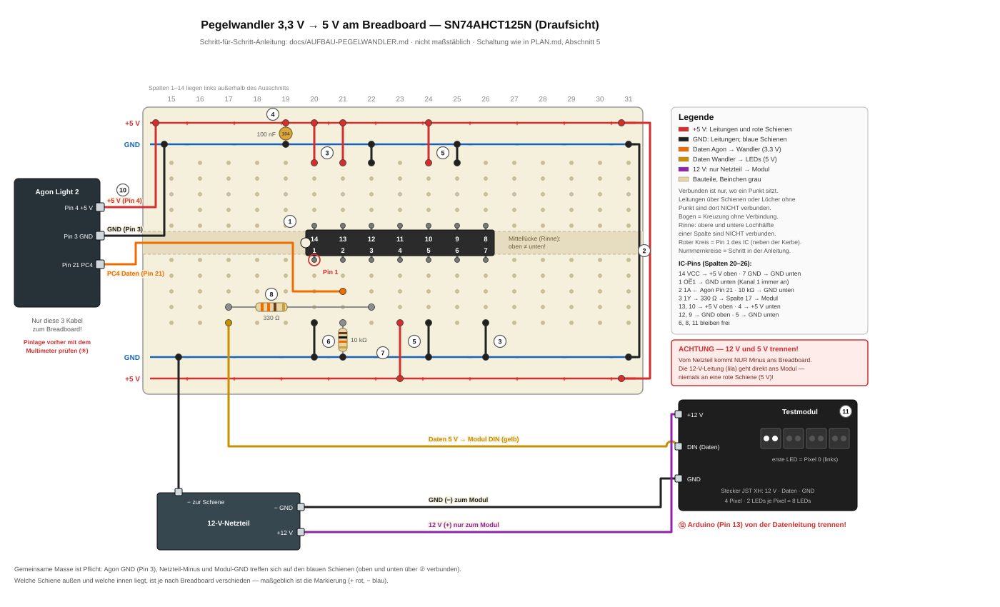

# Pegelwandler 3,3 V → 5 V auf dem Breadboard — Schritt für Schritt

Stand: 2026-09-13, nach Review überarbeitet und am selben Tag aufgebaut, in Betrieb
genommen und erprobt: Der LED-Test aus `start.bas` lief über diesen Aufbau komplett
durch, Schritt 6 zeigte schwaches, gleichmäßiges Weiß. Basiert auf der Schaltung in
[PLAN.md](PLAN.md), Abschnitt 5. Zielgruppe: ohne Elektronik-Vorkenntnisse. Wer schon
gelötet hat, liest nur Tabelle und Checkliste.

## 1. Was das soll

Der Agon Light 2 gibt auf seinen GPIO-Pins **3,3 V** aus. Die Lumanode-Module werden mit
**12 V** versorgt; die LED-Chips (SK6812) darin arbeiten intern aber mit **5-V-Logik** und
erkennen ein 3,3-V-Datensignal nur unzuverlässig. Der Baustein **SN74AHCT125N** nimmt das
schwache Signal entgegen und gibt es kräftig mit 5 V wieder aus — er ist ein
„Pegelwandler". Zwischen ihm und den LEDs sitzt noch ein 390-Ω-Widerstand, der Störungen
auf der Datenleitung dämpft.

Wichtigster Sicherheitsgrundsatz dabei: **Die Agon-Pins vertragen keine 5 V.**
Deshalb geht vom Breadboard mit 5 V auch nie ein Kabel zurück zum Agon — einziges
Kabel zum Agon-Signalpin ist die Leitung vom Agon zum Eingang des Wandlers.

## 2. Bauteile

| Bauteil | Wie du es erkennst |
|---|---|
| SN74AHCT125N | schwarzer Chip mit 14 Beinchen in zwei Reihen (DIP-14), Aufdruck „74AHCT125" |
| Widerstand 390 Ω (Datenleitung) | 4 Ringe: **orange–weiß–braun**–gold · 5 Ringe: **orange–weiß–schwarz–schwarz**–braun |
| Widerstand 8,2 kΩ (Pull-down) | 4 Ringe: **grau–rot–rot**–gold · 5 Ringe: **grau–rot–schwarz–braun**–braun |
| Kondensator 100 nF | kleine Keramik-Scheibe oder -Perle, Aufdruck „**104**" |
| Breadboard | Steckbrett mit Löchern im Raster und zwei Schienenpaaren |
| Jumperkabel | weiblich–männlich (Agon → Breadboard) und männlich–männlich (auf dem Breadboard) |
| Multimeter | **Pflicht** für die Pin-Gegenprobe am Agon (Schritt 9) |
| Kondensator 1000 µF | nur für die große Wand, nicht für das Testmodul — siehe unten |

Farbringe sind im Zweifel schwer zu lesen: Mit dem Multimeter im Ohm-Bereich nachmessen.

**Andere Widerstandswerte gehen auch:**

- **Datenleitung:** alles von etwa 220 bis 470 Ω. Die Lumanode-Doku empfiehlt
  220–470 Ω; an der Wand steckt schon ein 390 Ω vor LED 49. Die Schaltung in PLAN.md
  nennt 330 Ω, aufgebaut wird mit 390 Ω.
- **Pull-down:** alles von 4,7 bis 47 kΩ — 15 kΩ geht genauso wie 8,2 kΩ; PLAN.md
  nennt 10 kΩ.
- **Nicht als Pull-down taugen Werte von einigen hundert Ohm.** Bei 390 Ω müsste der
  Agon-Pin bei jedem High-Bit rund 8,5 mA liefern. Das belastet ihn unnötig, und das
  3,3-V-Signal kann so weit einbrechen, dass der Wandler es nicht mehr sicher erkennt.
- **Fehlt ein passender Pull-down,** darf er am Testmodul notfalls weg: Dann können die
  LEDs beim Einschalten kurz zufällig aufblitzen, bis `start.bas` den Pin setzt. Für die
  ganze Wand ist er Pflicht — zufälliges Vollweiß auf 288 LEDs kann kurz über die
  Stromgrenze gehen.

**Kondensatoren — was brauchst du wirklich?**

- **100 nF am IC:** Ein Keramik-Kondensator mit Aufdruck „104" ist genau richtig. Die
  Spannungsfestigkeit steht auf solchen Sortimenten meist nicht drauf; üblich sind 50 V,
  für die 5 V hier mehr als genug.
- **1000 µF an der 12-V-Einspeisung:** Nur für die komplette Wand, er fängt beim
  Einschalten Stromspitzen ab. Keramik-Kondensatoren aus dem Bereich 10 pF–100 nF können
  ihn **nicht** ersetzen — ihnen fehlt der Faktor 10 000 an Kapazität. Wenn es so weit
  ist: einen **Elektrolyt-Kondensator 1000 µF mit mindestens 16 V, besser 25 V** kaufen.
  Ein Elko mit zu kleiner Spannungsangabe kann platzen. Am Testmodul entfällt er.

## 3. So funktioniert das Breadboard

Lege das Breadboard quer vor dich, Spaltennummerierung lesbar (1, 2, 3 … von links
nach rechts).

```
  obere Schienen    + + + + + + + + + + + +   rot  (+5 V)
                    − − − − − − − − − − − −   blau (GND)
  ─────────────────────────────────────────
  obere Hälfte      je Spalte 5 Löcher
  ═══════════ Mittellücke (Rinne) ═════════
  untere Hälfte     je Spalte 5 Löcher
  ─────────────────────────────────────────
  untere Schienen   − − − − − − − − − − − −   blau (GND)
                    + + + + + + + + + + + +   rot  (+5 V)
```

Drei Regeln, alles andere ergibt sich daraus:

1. **Spalte mit Mittellücke:** Die 5 Löcher *unterhalb* der Mittellücke einer
   Spalte sind intern alle metallisch verbunden. Die 5 Löcher *oberhalb* der
   Lücke derselben Spalte ebenfalls — aber die beiden Hälften sind **nicht**
   miteinander verbunden.
2. **Keine Verbindung zwischen Nachbarspalten.** Spalte 21 und Spalte 22 wissen
   nichts voneinander.
3. **Schienen:** Jede mit „+" (rot) oder „−" (blau) markierte Leiste ist der Länge nach
   durchgehend verbunden. Wir benutzen **beide Schienenpaare**, oben und unten: rot =
   **+5 V**, blau = **GND (Masse)**. Oben und unten sind *nicht* von selbst verbunden —
   das erledigen zwei Brückenkabel in Schritt 2. Welche Schiene außen und welche innen
   liegt, ist je nach Breadboard verschieden: Maßgeblich ist die Markierung, nicht die
   Lage.

Achtung: Bei manchen Breadboards sind die Schienen in der Mitte unterbrochen (Lücke in der
roten/blauen Linie). Dann entweder alles auf einer Hälfte des Breadboards aufbauen oder die
Schienenhälften zusätzlich mit kurzen Brückenkabeln verbinden.

## 4. Der Baustein und seine 14 Beinchen

Der IC wird mit der **Kerbe** (Einkerbung an einer Schmalseite) nach **links**
quer über die Mittellücke gesteckt, in den Spalten **20 bis 26** — pro Spalte ein
Beinchen pro Seite. Dann liegt **Pin 1 unten links** (der Kerbe am nächsten; oft
markiert mit einem kleinen eingepressten Punkt neben Pin 1).

```
 Spalte:          20     21     22     23     24     25     26
 obere Hälfte:   [14]   [13]   [12]   [11]   [10]   [ 9]   [ 8]
 Kerbe (links) ◖  ───────────── IC-Gehäuse ──────────────
 untere Hälfte:  [ 1]   [ 2]   [ 3]   [ 4]   [ 5]   [ 6]   [ 7]
```

Die Bedeutung der Pins (Y = Ausgang, A = Eingang, OE̅ = „output enable" mit Strich
oben = Freigabe bei Masse):

| Pin | Name | Job in unserer Schaltung |
|---|---|---|
| 14 | VCC | Stromversorgung +5 V |
| 7 | GND | Masse |
| 1 | OE̅1 | Kanal 1 freischalten → an GND |
| 2 | 1A | Eingang: Signal vom Agon (3,3 V) |
| 3 | 1Y | Ausgang: verstärktes Signal (5 V) → zu den LEDs |
| 4, 10, 13 | OE̅2-4 | unbenutzte Kanäle stilllegen → an +5 V |
| 5, 9, 12 | A2-4 | unbenutzte Eingänge → an GND |
| 6, 8, 11 | Y2-4 | unbenutzte Ausgänge → bleiben frei |

Die vier Kanäle des IC sind identisch — wir benutzen nur Kanal 1. Die anderen
werden „stillgelegt" (Eingänge nie offen lassen, Ausgänge abschalten), damit sie
nicht wild schwingen.

## 5. Der komplette Belegungsplan

Alles auf einen Blick. Pins der oberen IC-Reihe gehen an die **oberen** Schienen, Pins der
unteren Reihe an die **unteren** — so kreuzt kein Kabel den IC. Spalte 17 ist unser
Sammelpunkt für die Datenleitung Richtung LED-Modul.

| Breadboard-Ort | Bauteil/Pin | Verbindung |
|---|---|---|
| rechter Rand | 2 Brückenkabel | obere rote ↔ untere rote Schiene, obere blaue ↔ untere blaue Schiene |
| obere Schienen, bei Spalte 19 | 100 nF | ein Beinchen direkt in die rote, eins in die blaue Schiene |
| Spalte 17, untere Hälfte | 390 Ω (Bein 1) + Modul-Datenkabel | DIN-Knoten Richtung LED-Modul |
| Spalte 20, obere Hälfte | IC-Pin 14 (VCC) | → obere rote Schiene |
| Spalte 20, untere Hälfte | IC-Pin 1 (OE̅1) | → untere blaue Schiene |
| Spalte 21, obere Hälfte | IC-Pin 13 (OE̅4) | → obere rote Schiene |
| Spalte 21, untere Hälfte | IC-Pin 2 (1A) | ← Kabel vom Agon Pin 21; 8,2 kΩ direkt in die untere blaue Schiene |
| Spalte 22, obere Hälfte | IC-Pin 12 (4A) | → obere blaue Schiene |
| Spalte 22, untere Hälfte | IC-Pin 3 (1Y) | → 390 Ω (Bein 2) |
| Spalte 23, obere Hälfte | IC-Pin 11 (4Y) | frei |
| Spalte 23, untere Hälfte | IC-Pin 4 (OE̅2) | → untere rote Schiene |
| Spalte 24, obere Hälfte | IC-Pin 10 (OE̅3) | → obere rote Schiene |
| Spalte 24, untere Hälfte | IC-Pin 5 (2A) | → untere blaue Schiene |
| Spalte 25, obere Hälfte | IC-Pin 9 (3A) | → obere blaue Schiene |
| Spalte 25, untere Hälfte | IC-Pin 6 (2Y) | frei |
| Spalte 26, obere Hälfte | IC-Pin 8 (3Y) | frei |
| Spalte 26, untere Hälfte | IC-Pin 7 (GND) | → untere blaue Schiene |

Das alles als Schaubild in der Draufsicht:



*Abb.: Schaltung wie im Belegungsplan oben. Verbunden ist nur, wo ein Punkt sitzt —
Leitungen über Schienen oder Löcher ohne Punkt sind dort nicht verbunden. Der Bogen zeigt
eine Kreuzung ohne Verbindung. Die Nummernkreise entsprechen den Schritten aus
Abschnitt 6. Erzeugt mit `scripts/gen_breadboard_svg.py` — nach einer Schaltungsänderung
dort anpassen und neu ausführen.*

## 6. Schritt für Schritt

**Vorher: Agon ohne USB-Kabel, 12-V-Netzteil aus.**

1. **IC einstecken.** Kerbe nach links, Beinchen über die Mittellücke, Pin 1 in
   Spalte 20 unten. Sind die Beine nach außen gespreizt, drück sie vorsichtig auf
   einer flachen Unterlage gerade. Beim Einstecken gleichmäßig auf beide Reihen
   drücken. Kontrolliere: unten 20=Pin 1 … 26=Pin 7, oben 20=Pin 14 … 26=Pin 8.
2. **Schienen verbinden.** Am rechten Rand ein rotes Kabel von der oberen roten zur
   unteren roten Schiene, ein schwarzes von der oberen blauen zur unteren blauen.
3. **IC-Strom.** Rotes Kabel: Spalte 20 oben (Pin 14) → obere rote Schiene. Schwarzes
   Kabel: Spalte 26 unten (Pin 7) → untere blaue Schiene.
4. **100-nF-Kondensator.** Ein Beinchen direkt in die obere rote Schiene, das andere in
   die obere blaue, gleich links neben Spalte 20 (bei Spalte 19). Keramik-Kondensatoren
   haben keine Polung.
5. **Unbenutzte Kanäle stilllegen.** Oben: Spalte 21 (Pin 13) und Spalte 24 (Pin 10) →
   obere rote Schiene; Spalte 22 (Pin 12) und Spalte 25 (Pin 9) → obere blaue Schiene.
   Unten: Spalte 23 (Pin 4) → untere rote Schiene; Spalte 24 (Pin 5) → untere blaue
   Schiene.
6. **Kanal 1 freischalten.** Kabel von Spalte 20 unten (Pin 1, OE̅1) → untere blaue
   Schiene. Damit ist Kanal 1 dauerhaft aktiv.
7. **8,2-kΩ-Widerstand (Pull-down).** Ein Beinchen in Spalte 21 unten (dieselben 5 Löcher
   wie das IC-Bein Pin 2), das andere direkt in die untere blaue Schiene. Er hält den
   Eingang nach dem Einschalten ruhig auf Masse, bis der Agon den Pin steuert.
8. **390-Ω-Widerstand.** Ein Beinchen in Spalte 22 unten (Pin 3, 1Y), das andere in
   Spalte 17 unten. Das ist der Ausgang Richtung LEDs.
9. **Prüfen, bevor etwas an den Agon kommt** (Multimeter):
   - **Kurzschlusstest:** Multimeter auf Durchgang (Piepser), Messspitzen an rote und
     blaue Schiene. Es darf **nicht dauerhaft** piepen; ein kurzer Piep beim Aufsetzen
     ist normal, weil sich der 100-nF-Kondensator auflädt. Im Ohm-Bereich heißt ein Wert
     unter etwa 10 Ω Kurzschluss. Dann die Verdrahtung prüfen, erst danach weiter.
   - **Agon-Pins gegenprüfen** — Pflicht, siehe Abschnitt 7.
10. **Agon anschließen** (drei Kabel mit Buchse am Agon, siehe Abschnitt 7):
    Pin 3 (GND) → obere blaue Schiene, Pin 4 (+5 V) → obere rote Schiene,
    Pin 21 (PC4) → Spalte 21 unten.
11. **LED-Modul und Netzteil anschließen** (Abschnitt 7 unten).
12. **Arduino trennen:** Der Draht, der bisher vom Arduino **Pin 13** zur
    Datenleitung der Module ging, wird abgezogen. Keine Ausnahme — zwei Treiber
    an einer Datenleitung können sich gegenseitig die Ausgänge beschädigen.

## 7. Die Kabel zum Agon, zum Netzteil und zum Modul

### Am Agon die richtigen Pins finden

Der GPIO-Anschluss des Agon ist die Doppelreihe mit 34 Stiften (2 × 17). Eine
Reihe trägt die ungeraden Nummern (1, 3, 5 … 33), die andere die geraden
(2, 4 … 34); Pin-Paare wie 3/4 oder 21/22 stehen sich direkt gegenüber.

Die Stifte sind auf der Platine beschriftet: **Pin 1 sitzt oben rechts, Pin 2 direkt
darunter**. Gezählt wird Spalte für Spalte nach links, ungerade Nummern oben, gerade
unten. Elektrisch gegenprüft am 2026-09-13, schwarze Spitze an Pin 3: Pin 4 = 5,15 V,
Pin 2 = 4,95 V (hängt wie Pin 4 an der USB-5-V-Leitung), Pin 33 = 0 V, Pin 34 = 3,2 V.

| Agon-Pin | Signal | Wohin |
|---|---|---|
| **3** | GND | obere blaue Schiene |
| **4** | +5 V | obere rote Schiene |
| **21** | PC4 (Daten) | Spalte 21 untere Hälfte (nur dahin!) |

Pin 2 führt ebenfalls 5 V, ist aber der Versorgungseingang vom USB-Anschluss — **nicht
verwenden, immer Pin 4.**

Zählhilfe: Von Pin 1 aus eine Spalte weiter liegt Pin 3 (GND), ihm genau
gegenüber Pin 4 (+5 V). Pin 21 liegt in derselben Längsreihe wie Pin 1, als
elfte Spalte von der Pin-1-Ecke aus gezählt (bzw. siebte von der anderen Seite);
ihm gegenüber liegt Pin 22.

**Gegenprobe** (am 2026-09-13 bestanden, Werte siehe oben): Agon per USB einschalten,
noch nichts angesteckt. Multimeter auf Gleichspannung, schwarze Messspitze an den
gezählten Pin 3.

- Rote Spitze an den gezählten **Pin 4**: **≈ 5 V**.
- Rote Spitze an den gezählten **Pin 34** (letzte Spalte, Reihe der geraden Nummern):
  **≈ 3,3 V**.

Stimmen beide Werte, stimmt die Zählrichtung. Sonst: nicht anstecken, Zählung
wiederholen.

### Netzteil und Testmodul

Das Testmodul hat einen dreipoligen Stecker (JST XH). Die Reihenfolge der Kontakte ist
**12 V – Daten – GND**, die Daten liegen in der Mitte. Übliche Aderfarben sind Rot = 12 V
und Schwarz = GND; die Farben können abweichen, die Reihenfolge nicht. Angeschlossen wird
der **Eingang** des Moduls — dort, wo sonst das Kabel vom vorigen Modul bzw. vom Arduino
ankommt. Männliche Jumperstifte passen in die JST-XH-Buchse, sitzen aber locker; im Zweifel
mit Klebeband sichern.

```
12-V-Netzteil (+) ────────────────────────────── 12-V-Kontakt des Moduls (direkt, nie aufs Breadboard!)
12-V-Netzteil (−) ──┬─────────────────────────── GND-Kontakt des Moduls
                    └── untere blaue Schiene (Breadboard)
Datenkontakt (Mitte) ─────────────────────────── Spalte 17, untere Hälfte
```

⚠️ **Die größte Gefahr der ganzen Anleitung:** Das 12-V-Netzteil speist *nur* das
Modul. Von ihm kommt *allein das Minus-Kabel* auf die blaue Schiene. Das 12-V-Kabel geht
direkt ans Modul und darf keine rote Schiene (5 V) **je** berühren — 12 V auf der
5-V-Schiene zerstören den Pegelwandler und den 5-V-Ausgang des Agon.

Für die große Wand kommt zusätzlich der 1000-µF-Elko (mindestens 16 V, besser 25 V)
direkt an die 12-V-Einspeisung der Matrix: längeres Bein = Plus an 12 V, Seite mit dem
Streifen = Minus an GND. Er schluckt Einschaltstromspitzen. Am einzelnen Testmodul
entfällt er.

## 8. Checkliste vor dem Einschalten

1. IC-Kerbe zeigt nach links, IC sitzt in Spalten 20–26, nirgends ein Bein
   verbogen oder außen.
2. Beide Brücken am rechten Rand: rot ↔ rot, blau ↔ blau.
3. Kurzschlusstest rot ↔ blau bestanden, Agon-Pins gegengeprüft (Schritt 9).
4. Nur drei Kabel gehen zum Agon: Pin 3 → blau, Pin 4 → rot, Pin 21 → Spalte 21
   unten. **Kein anderes Kabel berührt einen Agon-Pin.**
5. Die roten Schienen werden ausschließlich vom Agon Pin 4 gespeist. Das 12-V-Kabel
   vom Netzteil steckt nur am Modul.
6. Gemeinsame Masse: Agon Pin 3, Netzteil-Minus und Modul-GND treffen sich auf den
   blauen Schienen.
7. Arduino-Pin-13-Draht ist abgezogen.
8. 8,2 kΩ in Spalte 21 unten → untere blaue Schiene; 390 Ω in Spalte 22 unten →
   Spalte 17 unten; Datenkontakt des Moduls in Spalte 17 unten.

Messpunkte (nach dem Einschalten):

- IC-Pin 14 gegen blaue Schiene: ≈ 5 V.
- IC-Pin 2 (Spalte 21 unten) gegen blaue Schiene: **unter 0,8 V**. Direkt nach dem
  Einschalten hält das der Pull-down; sobald `start.bas` läuft, zieht der Agon den Pin
  selbst auf Low. Während der LED-Ausgabe zeigt das Multimeter einen kleinen Mittelwert
  der 3,3-V-Impulse.

## 9. Einschalten und testen

1. 12-V-Netzteil einschalten, dann den Agon per USB starten (oder umgekehrt —
   kritisch ist nur, dass die Masse bereits über die blaue Schiene verbunden ist).
2. Der Agon startet `start.bas` von selbst: aufsteigend **C-E-G** = bereit.
3. Beliebige Taste (z. B. Leertaste) startet den LED-Test: hoher Doppelpiep, dann
   kündigen *n kurze Pieps* Schritt *n* an.
4. **Schritt 6 ist der Tauglichkeitsnachweis:** Alle 8 LEDs des Testmoduls müssen
   **schwaches, gleichmäßiges Weiß** zeigen.
5. Ende: absteigend G-E-C. Mit Taste `3` gehen die LEDs aus, mit `0` landest du
   im BASIC-Prompt. Nachschauen kannst du jederzeit mit
   `python scripts/agonmon.py`.

Zeigt Schritt 6 stattdessen **bunte, flackernde Farben**, ist das ein
Timing-Problem der Bitausgabe — Kette nicht weiterbauen, sondern melden
(PLAN.md, Abschnitt 0 und 11: NOPs in `ws2812.asm` anpassen oder Plan B, SPI).

## 10. Wenn gar nichts leuchtet

| Symptom | Erst prüfen |
|---|---|
| Agon startet nicht oder piept nicht, sobald das Breadboard dran ist | Sofort USB abziehen. Kurzschluss zwischen roter und blauer Schiene? Kurzschlusstest aus Schritt 9 wiederholen. |
| Modul komplett dunkel | 12 V am Modul? Gemeinsame Masse (blaue Schiene) verbunden? Datenkontakt wirklich am *Eingang* des Moduls? |
| Alles an, aber keine Reaktion auf den Test | Brücken rot ↔ rot, blau ↔ blau gesteckt? 390 Ω in den richtigen Spalten? Kabel vom Agon Pin 21 wirklich in Spalte 21 unten, nicht auf einem Y-Ausgang? |
| LEDs leuchten, aber falsch/bunt | Timing — siehe Abschnitt 9 |

Zur Einordnung: Das bekannte Problemmodul (altes Modul 6, heute Kettenposition 30,
Ausgang defekt — `debugFreeze.md` im Lumanode-Projekt) betrifft nur die komplette
Wand. Am einzelnen Testmodul fällt es nicht auf, selbst wenn es zufällig eben
dieses Modul sein sollte — sein *Eingang* ist gesund.
